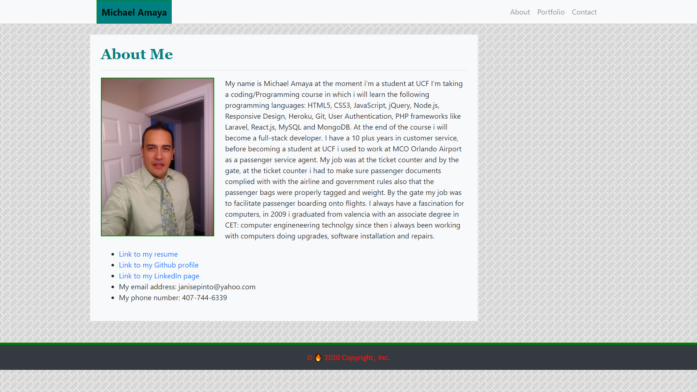

# responsive_portfolio
## Description 
This is the second homework it requires to have a responsive design using Bootstrap ensuring that web applications render well on a variety of devices and window or screen sizes. make 3 html files: `contact.html`, `index.html` and `portfolio.html`. Make an assests folder, inside that folder make a css folder and an images folder. inside the css folder make a `style.css` file, inside the image folder put all the images for the project.

# screenshot 

# link to deployed app
https://github.com/eradicador/Responsive-Portfolio

# contact html file
line 8 !-- added the css stylesheet from bootstrap site introduction -->

line 12 !-- changed the title name -->

line 17 !-- added navbar code from bootstrap -->

line 20 !-- added my name to the navbar -->

line 29 !-- linked the index.html and changed the link name to About -->

line 33 !-- linked the portfolio.html and changed the link name to Portfolio -->

line 37 !-- linked the contact.html and changed the link name to Contact -->

line 44 !-- added a container -->

line 46 !-- added a row -->

line 48 !-- added a column, a background color, a margin top, padding all around it and a margin bottom  -->

line 50 !-- added a heading h2 with bold text and the text -->

line 52 !-- added a thematic break -->

line 54 !-- added a form from bootstrap for the contact info -->

line 57 !-- changed the text to Name -->

line 62 !-- changed the text to Email -->

line 68 !-- added this part of code from bootstrap for the message section -->

line 70 !-- changed the text to Message -->

line 72 !-- changed the rows to 6 -->

line 75 !-- changed the color of the button to teal -->

line 81 !-- added a footer, a class and a background -->

line 83 !-- added a class -->

line 85 !-- added a class, a padding top, a copyright icon, a fire icon and the text -->

line 90 !-- added the code for javascrpit from bootstrap introduction -->

# index html file
line 8 !-- added the css stylesheet from bootstrap site introduction -->

line 12 !-- changed the title name -->

line 17 !-- added navbar code from bootstrap -->

line 20 !-- added my name to the navbar -->

line 29 !-- linked the index.html and changed the link name to About -->

line 33 !-- linked the portfolio.html and changed the link name to Portfolio -->

line 37 !-- linked the contact.html and changed the link name to Contact -->

line 44 !-- added a container -->

line 46 !-- added a row -->

line 48 !-- added a column, a background, a margin top and some padding all around it -->

line 50 !-- added a heading, bold text and Portfolio text -->

line 52 !-- added a thematic break -->

line 56 !-- added a row -->

line 58 !-- added a column, a background color and padding all around it -->

line 60 !-- added a placeholder, a image description, a class, text center and the text -->

line 64 !-- added a column, a background color and padding all around it -->

line 66 !-- added a placeholder, a image description, a class, text center and the text -->

line 70 !-- added a row -->

line 73 !-- added a column, a background color and padding all around it -->

line 75 !-- added a placeholder, a image description, a class, text center and the text -->

line 79 !-- added a column, a background color and padding all around it -->

line 81 !-- added a placeholder, a image description, a class, text center and the text -->

line 86 !-- added a row -->

line 88 !-- added a column, a background color, padding all around it and a margin bottom -->

line 95 !-- added a footer, a class and a background -->

line 97 !-- added a class -->

line 99 !-- added a class, a padding top, a copyright icon, a fire icon and the text -->

line 104 !-- added the code for javascrpit from bootstrap introduction -->

# portfolio html file
line 8 !-- added the css stylesheet from bootstrap site introduction -->

line 12 !-- changed the title name -->

line 17 !-- added navbar code from bootstrap -->

line 20 !-- added my name to the navbar -->

line 29 !-- linked the index.html and changed the link name to About -->

line 33 !-- linked the portfolio.html and changed the link name to Portfolio -->

line 37 !-- linked the contact.html and changed the link name to Contact -->

line 44 !-- added a container -->

line 46 !-- added a row -->

line 48 !-- added a column, a background color, a margin top and a margin bottom -->

line 50 !-- added a heading h2, bold text and About Me text -->

line 52 !-- added a thematic break -->

line 55 !-- added a image, a description for the picture, a class and margin right -->

line 57 !-- added 2 lorem text paragraphs -->

line 77 !-- added a footer, a class and a background -->

line 79 !-- added a class -->

line 81 !-- added a class, a padding top, a copyright icon, a fire icon and the text -->

line 86 !-- added the code for javascrpit from bootstrap introduction -->

# CSS file
line 2 /* made a box for my name in the navbar */

line 10 /* added a background image  */

line 14 /* made the image in index.html to float left and added a border */

line 19 /* added font style and color to the headings h2 */

line 24 /* added banners to the pictures in Portfolio.html  */

line 34 /* added the bar to the footer, moved the text to the center, added color to text  */

## License

MIT License

Copyright (c) [2020] [Michael Amaya]

Permission is hereby granted, free of charge, to any person obtaining a copy
of this software and associated documentation files (the "Software"), to deal
in the Software without restriction, including without limitation the rights
to use, copy, modify, merge, publish, distribute, sublicense, and/or sell
copies of the Software, and to permit persons to whom the Software is
furnished to do so, subject to the following conditions:

The above copyright notice and this permission notice shall be included in all
copies or substantial portions of the Software.

THE SOFTWARE IS PROVIDED "AS IS", WITHOUT WARRANTY OF ANY KIND, EXPRESS OR
IMPLIED, INCLUDING BUT NOT LIMITED TO THE WARRANTIES OF MERCHANTABILITY,
FITNESS FOR A PARTICULAR PURPOSE AND NONINFRINGEMENT. IN NO EVENT SHALL THE
AUTHORS OR COPYRIGHT HOLDERS BE LIABLE FOR ANY CLAIM, DAMAGES OR OTHER
LIABILITY, WHETHER IN AN ACTION OF CONTRACT, TORT OR OTHERWISE, ARISING FROM,
OUT OF OR IN CONNECTION WITH THE SOFTWARE OR THE USE OR OTHER DEALINGS IN THE
SOFTWARE.